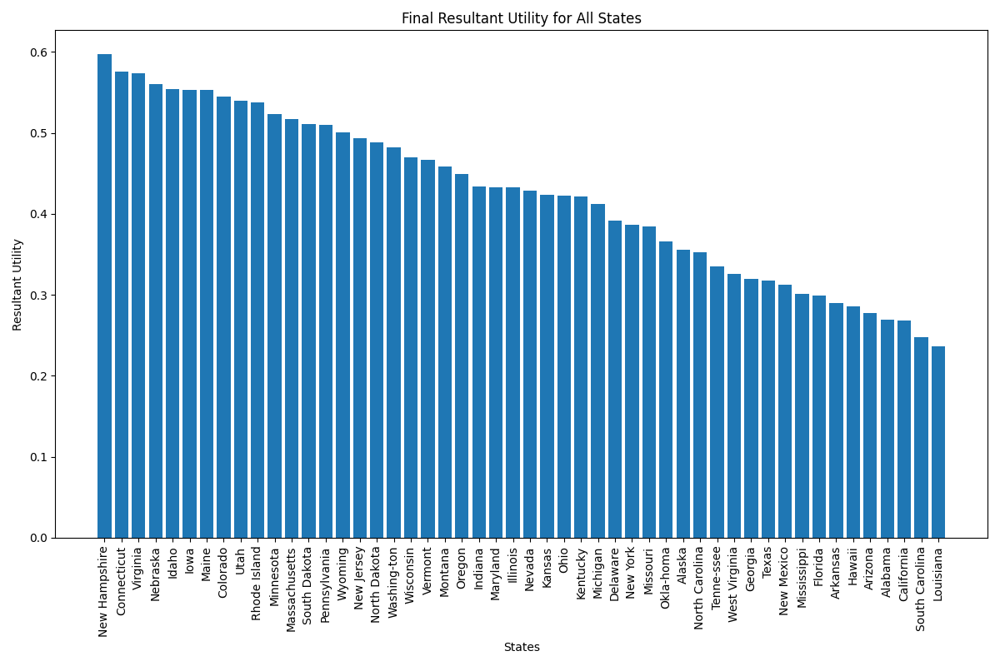
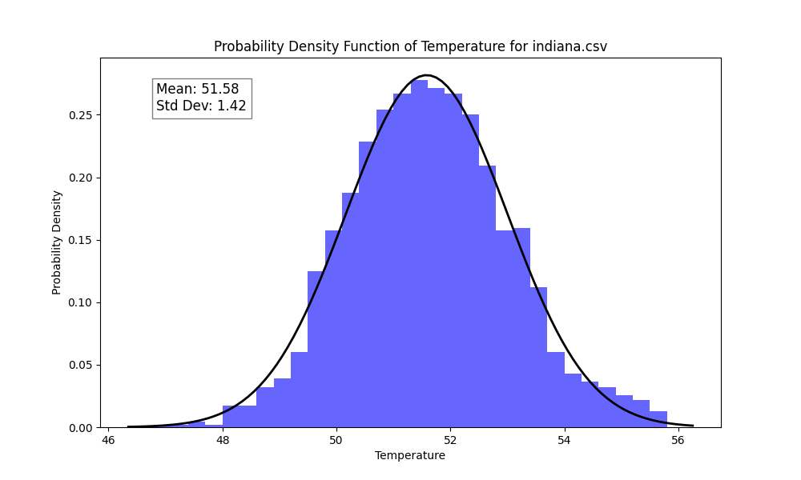
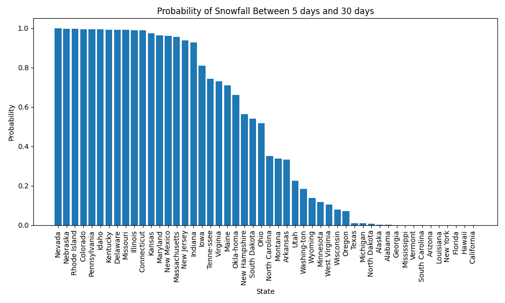
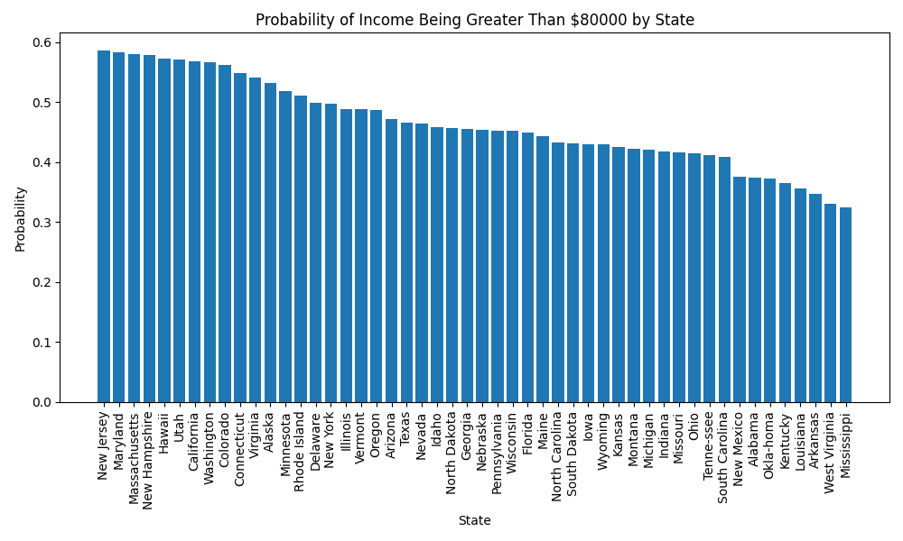
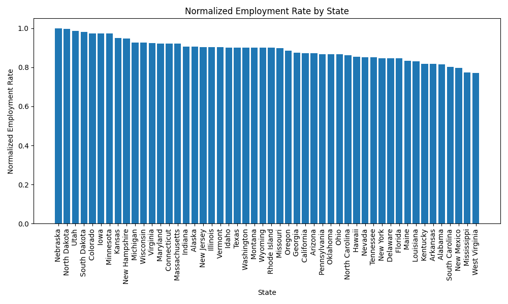
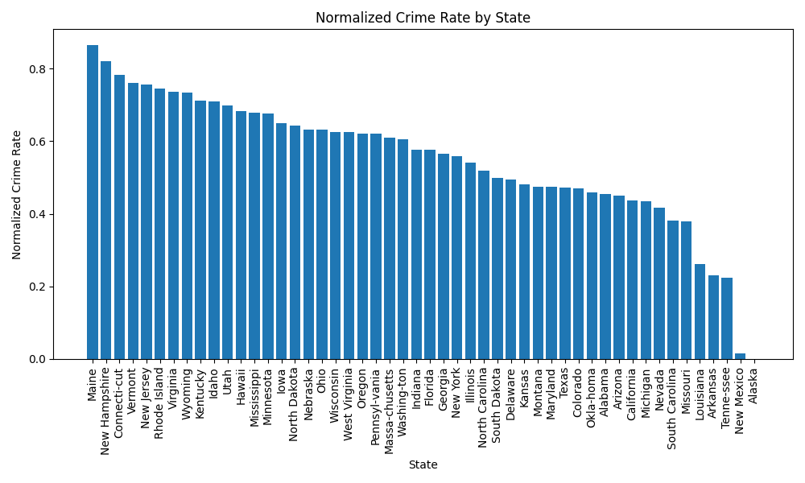
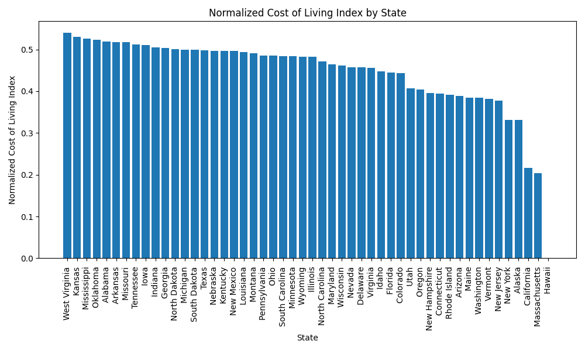

# Find Your State

## Description
This project helps users decide which American state is the best to live in based on the following criteria: 
1. Income 
2. Employment Rate 
3. Cost of Living 
4. Crime Rate 
5. Annual Average Temperature 
6. Number of Snowfall Days

You can customize these criteria to your needs. Instructions are provided in the configuration settings.

## Cloning the Repository and Setting Up the Virtual Environment
To get started with the project, follow these steps:

1. Clone the repository:
    ```sh
    git clone https://github.com/Naveen-Raj-M/find_your_state.git
    ```

2. Navigate to the project directory:
    ```sh
    cd find_your_state
    ```

3. Build the virtual environment:
    ```sh
    source build_venv.sh
    ```

## Executing the Script
To execute the `find_your_state.py` script, use the following command:
```sh
python3 -m engine.find_your_state --config-path ../ --config-name config.yaml
```

<details>
<summary>## Configuration file</summary>

```yaml
defaults:
    - _self_
    - override hydra/hydra_logging: disabled  
    - override hydra/job_logging: disabled  

hydra:
    output_subdir: null  
    run:
        dir: .

# weather configuration
weather:
    temperature: 50
```
- This section configures the weather criteria. The `temperature` key sets the preferred average annual temperature.

```yaml
# snow configuration
snowfall:
    upper_bound: 30
    lower_bound: 5
```
- This section configures the snowfall criteria. The `upper_bound` and `lower_bound` keys set the acceptable range for the number of snowfall days.

```yaml
# income configuration
income:
    minimum: 80000
```
- This section configures the income criteria. The `minimum` key sets the minimum acceptable annual income in USD.

```yaml
# risk_affinity configuration
r:
    weather: 1
    snowfall: 0.5
    employment: 2
    crime_rate: 2
    cost_of_living: 1
    income: 3
```
- This section configures the risk affinity for each criterion. Set 
    `r` < 1 for risk-aversive utility
    `r` = 1 for risk-neutral utility
    `r` > 1 for risk-seeking utility

```yaml
# weights configuration
weights:
    weather: 10
    snowfall: 10
    employment: 20
    crime_rate: 20
    cost_of_living: 15
    income: 25
```
- This section configures the weights for each criterion. The values represent the relative importance of each criterion in the final decision-making process.

</details>

<details>
<summary>## Results</summary>

The final result will look like this

> Final Ranking of States

Beyond the final ranking, you can also visualize the historic data of average annual temperature for each state, and how each State performed in each criteria


> PDF of historic data of Annual Average Temperature of Indiana


> Probability of no of snowfall days being between the given range


> Probability of average household income greater than the given value


> Performance of various states in employment rate


> Performance of various states in crime rate


> Performance of various states in cost of living index

</details>


## Sources of data
1. Weather and Snowfall: National Centers for Environmental Information (www.ncei.noaa.gov)
2. Employment Rate: U.S. Bureau Of Labor Statistics (www.bls.gov)
3. Cost of Living: Missouri Economic Research and Information Center (https://meric.mo.gov/)
4. Income: United States Census Bureau (https://data.census.gov/)
5. Crime Rate: FBI Crime Data Explorer (https://cde.ucr.cjis.gov/)